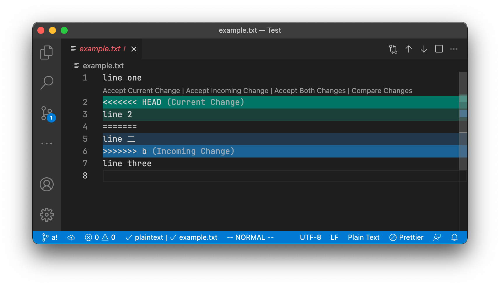
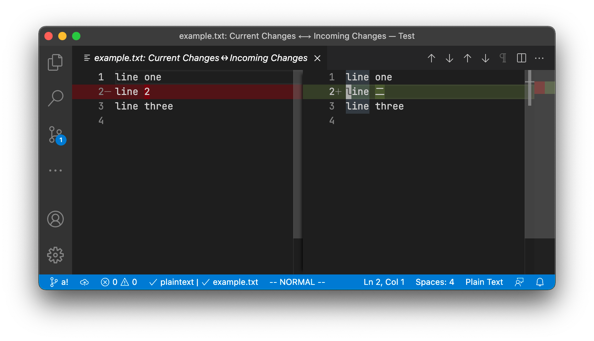
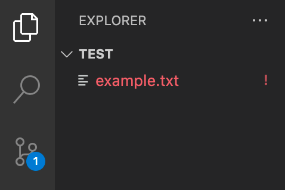
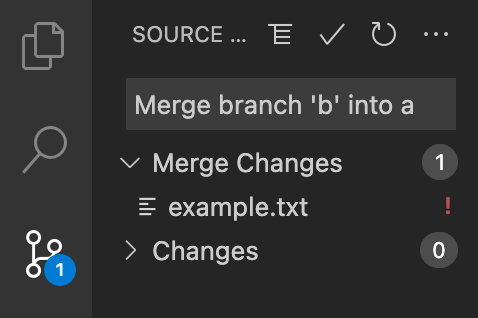
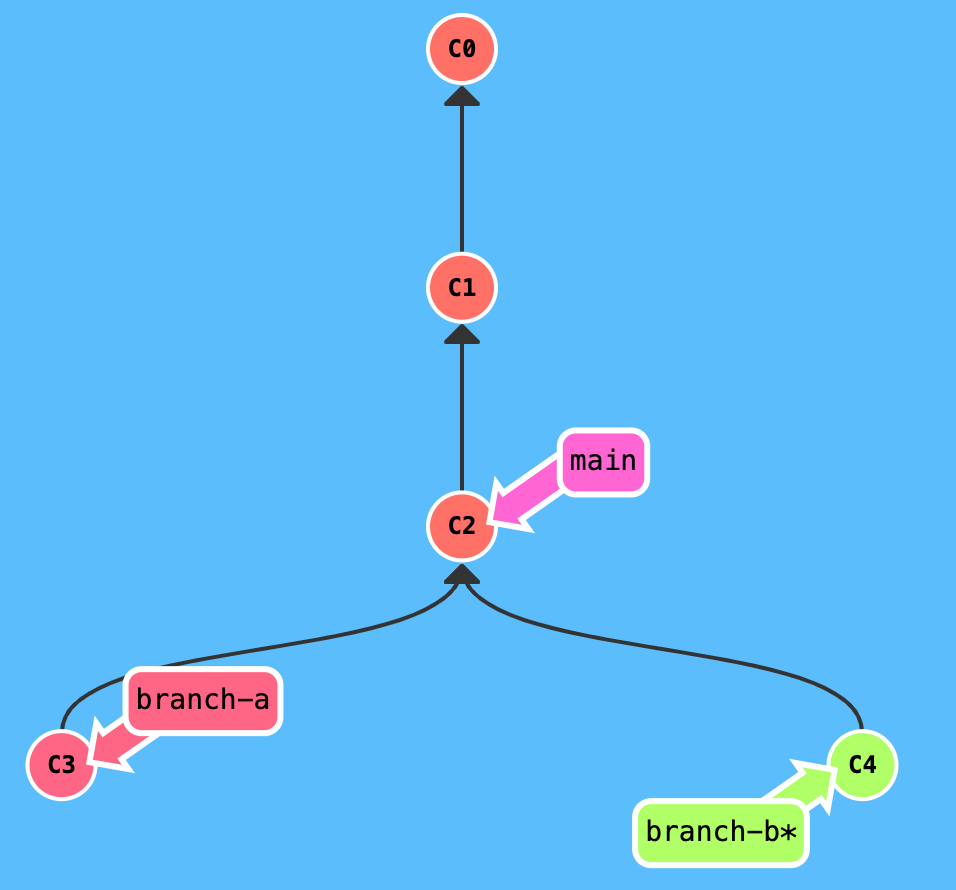

# 解决代码合并冲突

在使用 Git 对我们的项目代码进行版本管理时，我们往往会使用各种分支（branch）来将我们的代码隔离在其他人的分支和主分支以外，这样我们就能确保我们的代码不会影响到其他人，也不会影响到项目的主分支。然而，当我们完成了自己的工作，准备将自己的分支合并到主分支时，有可能会出现合并冲突（merge conflict），导致我们的分支无法被合并。

???+info
    本文中会多次出现主分支的概念。狭义上，主分支指的是像 `master` 分支或 `main` 分支这样的分支，它们是各种特性（feature）分支、bug 修复分支等分支的最终归属。广义上，它们也可以指那些汇聚了多个分支的修改的分支，比如开发（develop）分支或者测试（test）分支，这些分支在经过充分的测试之后会进入下一个流程，比如合并到最终的 `master` 分支。

什么是合并冲突？如何解决合并冲突？本篇文章接下来将一一介绍。此外，本文还会对比 `git merge` 和 `git rebase` 在合并分支上的区别，以及介绍 `fast-forward` 方法和一些有效缓解合并冲突产生的方法。

## 什么是合并冲突

一般来说，假设我们在 `a` 分支上通过 `git merge b` 或者 `git rebase b` 来将 `b` 分支合并进当前的分支，同时发生了以下情况中的至少一个时，就会发生合并冲突：

- `a` 分支和 `b` 分支的作者修改的代码中都包含同一个文件的同一行。
- `a` 分支的作者修改了某个文件，而 `b` 分支的作者删除了这个文件。

例如，假设 `a` 分支和 `b` 分支都源于 `master` 分支，此分支只有一个 `example.txt` 文件：

=== "example.txt"

    ``` linenums="1"
    line one
    line two
    line three
    ```

`a` 分支的作者将第二行修改为了 `line 2` 而 `b` 分支的作者将第二行修改为了 `line 二`，此时如果 `a` 分支想要合并入 `b` 分支，**Git 无法确定合并的结果里 `example.txt` 的第二行到底应该取 `a` 分支的修改，还是取 `b` 分支的修改，合并冲突就此发生**。

如果你使用了 `git merge b` 命令，你会得到以下的输出：

```
$ git merge b
Auto-merging example.txt
CONFLICT (content): Merge conflict in example.txt
Automatic merge failed; fix conflicts and then commit the result.
```

如果你使用了 `git rebase b` 命令，你会得到以下的输出：

```
$ git rebase b
Auto-merging example.txt
CONFLICT (content): Merge conflict in example.txt
error: could not apply 4404526... commit a 1
Resolve all conflicts manually, mark them as resolved with
"git add/rm <conflicted_files>", then run "git rebase --continue".
You can instead skip this commit: run "git rebase --skip".
To abort and get back to the state before "git rebase", run "git rebase --abort".
Could not apply 4404526... commit a 1
```

???+note
    虽然我们使用的命令叫做 `git rebase`，但是 Git 的输出里仍然叫做 `merging`。不要和 `git merge` 混淆，**前者以及本文标题里的“合并”指的是广义上将两个分支的代码合并的过程**。而 `git rebase` 和 `git merge` 都能实现这一过程，但存在一些显著的区别，我们下文会讨论。

???+note
    一般情况下，Git 在分支合并时会自动为我们解决大多数的合并问题，比如在 `a` 分支的代码中套用 `b` 分支的各种修改，如新建文件、删除文件、修改代码行等，**只要这些操作不会产生上述的合并冲突**。而那些出现合并冲突的修改才会留给用户自己解决。

在多人协作的中大型项目中，合并冲突则更加容易发生。正如上文所说，每个人工作在自己的分支上时可以自由地根据自己的工作需要修改代码，而不用顾及其他人，因此工作在不同分支上的两个人修改了同一行代码的概率也就随之提升。除此之外，如果你的分支由于工作进度缓慢，迟迟不能被合并，那么这种时间因素导致出现合并冲突的概率和规模也会大大提升。

## 如何解决合并冲突

Git 在遇到合并冲突时，会将发生冲突的行使用具有特殊格式的几行替代。我们仍以上文的 `example.txt` 为例子，在执行合并操作之后，让我们查看 `example.txt` 的内容：

=== "example.txt"

    ``` linenums="1"
    line one
    <<<<<<< HEAD
    line 2
    =======
    line 二
    >>>>>>> b
    line three
    ```

这里，Git 将两个分支对这行做的修改都列了出来，并使用 `=======` 进行分割，同时使用 `<<<<<<<` 和 `>>>>>>>` 分别标出当前分支和要合并进来的分支名。Git 在这里的意思是让我们自己检查一下该如何处置冲突。要处置这里的冲突，我们有两种办法：一种是比较原始的纯文本编辑，即直接修改其中的几行；另一种是借助现代的代码编辑器提供的 Git 支持，使用可视化的方式高效地解决冲突。

???+info
    我们可以使用 `git status` 来查看当前合并冲突的状态，如下所示，输出中列出了发生冲突的文件名，以及我们可以使用 `git merge --abort` 来终止这次合并，也就是将当前的仓库回退到我们执行 `git merge b` 之前的状态。
    
    ```
    On branch a
    You have unmerged paths.
        (fix conflicts and run "git commit")
        (use "git merge --abort" to abort the merge)

    Unmerged paths:
        (use "git add <file>..." to mark resolution)
            both modified:   example.txt

    no changes added to commit (use "git add" and/or "git commit -a")
    ```
    

### 纯文本编辑

使用纯文本编辑的方法处置冲突时，我们只需要按需删除相应的行即可。比如，如果我们想要只保留我们自己的修改，可以将去掉第 2、4、5、6 行：

=== "example.txt"

    ``` linenums="1"
    line one
    line 2
    line three
    ```

如果我们想要同时保留我们的和分支 B 的修改，可以只去掉第 2、4、6 行。对于我们简单的 `example.txt` 例子来说，使用纯文本编辑的方式效率还不错，但是当我们工作在一个规模较大的多人协作项目时，出现的冲突往往行数更多，牵扯的代码逻辑也更为复杂，此时处理这些冲突的难度就会加大，我们也会更加容易犯错。

???+attention
    Git 不会检查你对合并冲突的处理是否“正确”。对于上面的例子，即使你什么都不做，也就是保留 `<<<<<<<` 和 `>>>>>>>` 等部分，你依然可以正常使用 `git add`、 `git commit` 和 `git push` 来将你的代码提交到远端仓库中。这是极其危险的，遗留下的这些部分往往会让源代码无法通过编译；或者更危险的情况是它通过了编译，并在生产环境下导致了恶劣的影响。

也许你认为自己不会愚蠢到忘记对冲突进行处理，但实践表明当发生冲突的文件数目众多时，那些仅仅依靠纯文本编辑的方法来解决冲突的人们很容易会漏掉几个发生冲突的文件，或者是几处冲突。因此，为了安全性和高效率，我们推荐使用接下来介绍的可视化方法来处理合并冲突。

### 可视化

现代的代码编辑器普遍内建或者通过插件提供了良好的 Git 支持，让我们可以以可视化的方式高效地解决合并冲突。例如在 VSCode 中，如果我们打开上面出现冲突的 `example.txt`，我们可以看到：



VSCode 为我们高亮了出现冲突的行，使用绿色表示当前分支的改动，使用蓝色表示要合并进来的分支的改动。同时，在高亮块的上方，我们还能看到几个选项按钮。分别是：

1. 套用当前的改动（Accept Current Change）
2. 套用合并进来的分支的改动（Accept Incoming Change）
3. 两边的改动都套用（Accept Both Change）
4. 对比两边的改动（Compare Changes）

其中第四个按钮点击之后会出现：



VSCode 会展示一个两栏的代码页，对比两个分支做出的改动，让我们更清晰地看到区别。

如下图所示，除了能够可视化地展示改动，VSCode 还能够列出发生了合并冲突地所有文件，并以红色标记其文件名，降低我们漏掉冲突文件的可能性。





像 GitHub 和 GitLab 这样的平台也为我们提供了在线的冲突解决功能，但对于过于复杂的冲突，它们基本不能解决，而是会要求你在本地解决。下图为 GitHub 为 Pull requests 提供的冲突解决页面，它列出了发生冲突的文件列表，以及高亮显示了冲突代码行：


## `git rebase` 和 `git merge` 的区别

我们在前文讲过，这两个命令都可以将两个分支的代码进行合并，而且合并出现冲突时都需要我们手动处理冲突代码行，并且执行一些命令来确认提交。从它们执行的结果来看，两者的功能是相同的，但它们却在实现的方式上存在显著的区别。

简单来说，我们可以将每一个分支看作一个由 commit 作为节点构成的树枝，如下图所示：



图中的每一个圆圈表示一次 commit，三个箭头分别表示三个分支目前指向的 commit 序列。从图中可以看到 `branch-a` 的 commit 序列是 `C0 -> C1 -> C2 -> C3`，也就是说这个分支上有这样的一些 commit。而 `main` 的 commit 序列则为 `C0 -> C1 -> C2`。

现在继续使用 `example.txt` 的例子，我们在 `a` 分支上执行 `git log --graph --format=oneline` 来查看当前分支的历史记录，得到以下输出：

```
* 4404526ee52af9994b409c713e1efc6651cef99e (HEAD -> a, origin/a) commit a 1
* 1518bc8eaa5ad79e31ef41b9b229d231bb82ccb2 (origin/master, master) commit master 1
```

在输出中，commit 按照时间从近到远的顺序依次被输出。其中第一行括号里的 `HEAD -> a` 表示 a 分支最新的 commit 就是当前行对应的 commit，并且我们目前正在这个 commit 上工作。

???+info
    输出中的第二个 commit，后面的括号内容 `origin/master, master` 的意思分别是：远程仓库的 `master` 分支指向了此 commit，本地仓库的也是。并不是所有输出的 commit 都会有这样的括号。

### `git merge`

假如我们此时执行 `git merge b` 并解决冲突，我们再运行 `git log --graph --format=oneline` 会得到以下输出：

```
*   6ee34e9a5bac24b26a958bd6f658c70b056f1f26 (HEAD -> a) Merge branch 'b' into a
|\
| * ab0502e4504a5f05012daf075611a74055fc83b2 (origin/b, b) commit b 1
* | 4404526ee52af9994b409c713e1efc6651cef99e (origin/a) commit a 1
|/
* 1518bc8eaa5ad79e31ef41b9b229d231bb82ccb2 (origin/master, master) commit master 1
```

输出的内容复杂了很多，注意里面的 `|`、`\` 和 `/` 符号，它们表示直线和折线，`*` 符号表示一个节点，这种作图方式表达的内容和上面给出的蓝底图片相似。

由于我们通过 `git merge b` 来将 `b` 分支上的 commit 合并到我们的 `a` 分支里，Git 会在历史记录中为我们完整地输出 `b` 分支上的所有 commit，并最终以一个折线汇入 `a` 分支里**在进行 `git merge` 之后自动产生的一次 commit** 上。

### `git rebase`

如果我们执行的不是 `git merge` 而是 `git rebase` 又会如何呢？在修复冲突之后，运行 `git log --graph --format=oneline` 得到的输出如下：

```
* dbb05d13734ee3054d0f132edd3bdf97a0997cbd (HEAD -> a) commit a 1
* ab0502e4504a5f05012daf075611a74055fc83b2 (origin/b, b) commit b 1
* 1518bc8eaa5ad79e31ef41b9b229d231bb82ccb2 (origin/master, master) commit master 1
```

我们发现 `rebase` 命令修改了 `a` 分支的 commit 序列，将 `a` 在和 `b` 的分叉点，也就是第三行指向的 commit **之后的所有 commit（为了简单，我们的例子只有第一行对应的 commit），重新设置到了 `b` 分支最新的 commit 上**，也就是说，我们现在的得到的 `a` 分支，等价于我们一开始就从 `b` 分支上新建一个分支进行修改。

Git 并没有像 `merge` 那样再输出一些折线了，**我们得到了一个平坦的、用一条直线就能串起来表示的 commit 记录**，它们看上去更加简单、直观。

### 对比

究竟应该使用 `merge` 还是 `rebase`，或者说这两种方法孰优孰劣，是程序员们除了究竟使用 tab 还是 space 作为缩进外的又一个争论不休的话题。

对于 `merge` 来说，虽然它较为安全，能够直观地展示各个分支的关系，但是在大型项目中往往会遇到分支数量过多导致 Git 历史记录乱成一团的问题。对于 `rebase` 来说，它则能够产生平整、简单的历史记录，但缺点是隐藏了真正的提交记录。

???+caution
    由于 `rebase` 会对当前分支的 commit 序列造成较大幅度的修改，我们必须谨慎地使用它。例如，如果我们在公共的分支，比如 `master` 上执行 `rebase`，那么很可能会对其他在此分支上工作的人造成恶劣影响，例如造成大量的合并冲突。
    
    又如，`rebase` 可能会导致重复冲突的问题。如果在 `a` 分支上进行 `git rebase master`，而在 `master` 上又出现了很多新的提交，那么在 Git 对你的 `a` 分支上的新提交进行冲突检查时，一种不幸的情况是你在 `a` 分支上的大量提交都产生了冲突，而 **Git 会要求你一个一个地解决这些提交对应的冲突**。但是这种情况对于 `merge` 来说却不是问题，因为它会先将 `master` 上新的提交”压缩“为一个提交，然后和当前的分支进行冲突检查，因此我们最多只会需要解决一次合并冲突。

究竟是使用 `merge` 还是 `rebase`，更多讨论可以在互联网上搜索得到，本文章不会给出决定性的建议，但会在后文列举一些有经验的开发者的实践，仅供参考。如果你是 Git 的初学者，我们建议使用 `merge` 为主。

## `git pull`

除了主动将当前的工作分支与另一个分支进行合并之外，我们还有一个常用的操作会涉及分支合并：`git pull`。按照 [Git 官方文档](https://git-scm.com/docs/git-pull)，它的作用是拉取远端仓库的更新，并将当前分支对应的远端分支进行合并。默认情况下，它等价于：

```
$ git fetch
$ git merge FETCH_HEAD
```

也就是说，假如我们在 `master` 分支上使用了 `git pull`，并且其他人之前在此分支上留下了很多新的 commit，那么 `git pull` 将会在拉取 `master` 对应的远端分支（通常是 `origin/master`）之后，**将 `origin/master` 分支合并到 `master` 上**。

我们仍使用 `example.txt` 的例子，假如此时有人在 `master` 分支上添加了新的一行：

=== "example.txt"

    ``` linenums="1" hl_lines="4"
    line one
    line two
    line three
    line four
    ```

此时我们本地的 `master` 分支还没有更新，依然是原来的三行，那么我们此时运行 `git pull`，Git 会像上文的情况一样要求我们为自动生成的 commit 填写 commit message。然后，我们运行 `git push`，最终运行 `git log --graph --format=oneline`，

```
*   2777790053f709f8caec337a5ee8349cf1147573 (HEAD -> master, origin/master) Merge remote-tracking branch 'origin/master'
|\
| * 554a828d80dd12a7b10267e594c22722b2e25907 commit master 2
|/
* 1518bc8eaa5ad79e31ef41b9b229d231bb82ccb2 commit master 1
```

可以看到，即使没有出现合并冲突，`git merge` 依然会产生一个 commit，并且会在 commit 记录里留下折线。有人会认为，这种方式会让我们主分支的 commit 记录变得混乱，为什么我们只是简单地同步了一下本地的 `master` 分支，就要在 commit 记录里留下这么复杂的记录呢？于是，他们会采用 `git pull --rebase` 命令，让 Git 在 `git fetch` 之后运行 `rebase` 而不是 `merge`，这样得到的 commit 记录如下：

```
* 554a828d80dd12a7b10267e594c22722b2e25907 (HEAD -> master, origin/master) commit master 2
* 1518bc8eaa5ad79e31ef41b9b229d231bb82ccb2 commit master 1
```

对比起来，确实简单了很多，看上去也更加符合我们对这种简单同步操作的预期。

???+info
    你可以使用 `git config pull.rebase true` 来让 `git pull` 默认使用 `rebase` 而不是 `merge`。

### `fast-forward`

但是，也有人担心 `rebase` 会在 `git pull` 时出现上文所说的一些问题，他们会使用被称为 `fast-forward` 方法来取代 `rebase` 和普通的 `merge`。对应的命令是 `git pull --ff-only`，它等价于以下两个命令：

```
$ git fetch
$ git merge --ff-only FETCH_HEAD
```

从命令中可以看到，`fast-forward` 是一种特殊的 `merge`。简单来说，他会像 `rebase` 那样合并分支，不会出现额外的 commit，也不会在 commit 记录里留下折线。但是，**如果出现像合并冲突这样的问题，它会拒绝进行合并**。由此看来，`fast-forward` 是一个相当安全的合并方法。很多人都推荐使用 `fast-forward`。

???+info
    你可以使用 `git config pull.ff only` 来让 `git pull` 默认使用 `fast-forward`。

## 参考实践

接下来将介绍一些常见的有关 Git 合并分支的实践，供读者参考。

### 在自己的分支上使用 `rebase`

在多数情况下，我们会因为要添加一项新功能，或者是进行一项修复工作而在主分支里创建一个新的分支，然后在上面工作。

某些时候，我们的工作可能需要依赖别人新做出的修改，比如某人修了一个 bug 并把分支合并到了主分支里，而我们刚好需要这个 bug 的修复。那么我们可以将主分支使用 `rebase` 来合并到我们自己的分支上。

这样做改变了我们分支的提交记录，因为我们的分支原本是从主分支上更早的提交上分出来的，`rebase` 之后则让它变成了基于主分支的最新提交。这样做在大多数情况下是可以接受的，我们不妨对比一下如果使用的是 `merge` 会怎么样：

1. 如上文所说，它会在我们的分支上产生一个合并的 commit。
2. 同时，在提交记录里会出现一条从主分支指向我们的分支的折线。

这样的结果让人难以接受，我们只是想利用一下主分支上最新的修改，却对提交记录产生了这些看上去不太必要的影响。如果我们使用 `rebase`，我们将摆脱上面的两点结果，得到清晰直观的提交记录。当然，使用 `rebase` 依然存在上文提到的重复冲突的问题，但对于我们自己的分支来说问题出现的概率或冲突的规模是较低的，因为我们的分支一般只会有较为少量的修改。

### 在合并自己分支时使用 `merge --no-ff`

一般来说，当我们在自己的分支上完成工作之后，我们会在主分支上使用 `git merge --no-ff` 来合并我们自己的分支。为什么要使用 `--no-ff` 参数呢？

默认情况下，`merge` 会使用 `--ff`，也就是说在条件允许的情况下使用 `fast-forward`，否则会创建一个用于合并的 commit。`--no-ff` 则是禁止使用 `fast-forward`，让 Git 总是创建一个新的 commit。

二者的区别主要体现在这样的一种情况：我们的主分支 `develop` 一直都没有任何修改，同时我们在刚分出来的 `feature` 分支做了几个 commit 并合并到主分支，这时二者的区别如下图所示（图片来自[《A successful Git branching model》](https://nvie.com/posts/a-successful-git-branching-model/)：


二者得到了不同的提交记录。右边的 `--ff` 在执行时发现情况适合，使用了 `fast-forward`，导致我们得到了一条呈直线形态的提交记录。这样看上去虽然很清晰，但**它让我们的 `feature` 分支被包含到了 `develop` 分支里**。在可视化的 Git 工具里，左边产生的提交记录能够让人们更直观地看到 `feature` 分支的存在，并且也能清晰地展现 `feature` 分支的独立性（从哪里分出来，又汇入到哪里）。

### 灵活运用 squash

squash 指的是将若干个 commit 合并为一个单独的 commit。此技巧常用在我们在自己的分支上工作完成后，在合并到主分支之前。有些团队鼓励这样做，因为在 squash 之后，我们的分支只剩下一个 commit，这样在合并之后，我们只会在主分支的提交记录上留下一个 commit 的记录，而这个 commit 正好对应了一个分支的所有修改，因此审阅起来是方便且直观的。

要进行 squash，我们可以使用交互式 `rebase`。通过运行 `git rebase -i HEAD~n`，Git 会调出文本编辑器来编辑当前分支最近 `n` 个 commit 的记录，例如：

```
pick d62788c commit a 2
pick e7eb691 commit a 3
pick e4846ad commit a 4

# Rebase 1bf37aa..e4846ad onto 1bf37aa (3 commands)
#
# Commands:
# p, pick <commit> = use commit
# r, reword <commit> = use commit, but edit the commit message
# e, edit <commit> = use commit, but stop for amending
# s, squash <commit> = use commit, but meld into previous commit
# f, fixup <commit> = like "squash", but discard this commit's log message
# x, exec <command> = run command (the rest of the line) using shell
# b, break = stop here (continue rebase later with 'git rebase --continue')
# d, drop <commit> = remove commit
# l, label <label> = label current HEAD with a name
# t, reset <label> = reset HEAD to a label
# m, merge [-C <commit> | -c <commit>] <label> [# <oneline>]
```

注意，commit 的输出顺序为从老到新，最下面的一行才是最新的 commit。将 最下面的两行前面的 `pick` 命令修改为 `s` 或 `squash`，并保存退出，这样 Git 就会将最新的两个 commit 合并到第一个 commit 里，同时调出另一个文本编辑器来要求我们输入这个新的融合 commit 的信息。

???+info
    交互式 `rebase` 还有很多强大的功能。如果你想知道有关其他命令的作用，请参考[官方文档](https://git-scm.com/docs/git-rebase)。

???+info
    `git merge` 也有一个叫做 `--squash` 选项，它的作用是将目标分支的所有新的 commit 合并为一个融合 commit 并放到当前分支上，但**不会对目标分支做任何修改。**

## 缓解合并冲突的产生

也许看到这里，你会认为 Git 的合并冲突解决起来未免也太过麻烦。其实，只要团队的编码习惯得当，我们能够遇到的合并冲突其实会相当地少。本文在此给出一些能够在一定程度上降低合并冲突发生概率的方法：

- 尽量对项目代码进行模块化调整，让每个人都工作在相对独立的代码模块中，这样不同的分支间就不容易出现对相同行的修改。
- Bug 修复分支应该确保尽量轻巧，一个分支对应一个 Bug 修复，减少分支对项目代码的修改量。
- 提高分支从创建到合并的速度，这涉及到选用合理的项目管理方法，以及代码审查制度。
